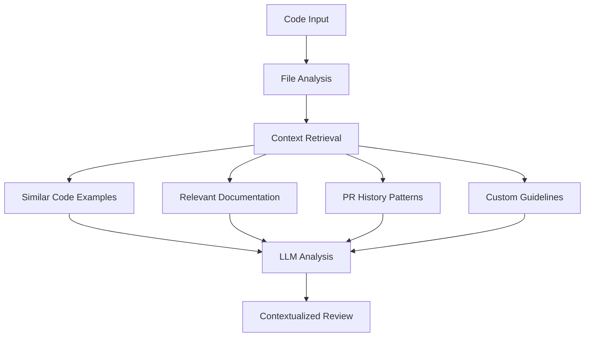

# CodeCritique

[](https://www.npmjs.com/package/codecritique)
[](https://www.npmjs.com/package/codecritique)
[](https://opensource.org/licenses/MIT)
[](https://nodejs.org/)
[](https://github.com/cosmocoder/CodeCritique/actions/workflows/release.yml)

**AI-Powered Code Review. Context-Aware. Privacy-First.**

A self-hosted code review tool using **RAG (Retrieval-Augmented Generation)** with local embeddings and Anthropic Claude for intelligent, context-aware code analysis. Works with any programming language.

[Features](#key-features) • [Installation](#installation) • [Quick Start](#quick-start) • [GitHub Actions](#github-actions-integration) • [Commands](#commands-reference) • [Contributing](#contributing)

---

## ❌ The Problem

Traditional code review tools fall short:

- ❌ **Generic static analysis** doesn't understand your codebase's unique patterns
- ❌ **No historical context** - ignores lessons from past code reviews
- ❌ **One-size-fits-all** rules that don't adapt to your team's standards
- ❌ **Limited language support** - often focused on specific tech stacks

## ✅ The Solution

**CodeCritique** uses RAG to deliver intelligent, context-aware code reviews:

- ✅ **Learns your codebase** - embeddings capture your patterns and conventions
- ✅ **Remembers PR history** - learns from past review comments and decisions
- ✅ **Custom guidelines** - integrates your team's coding standards
- ✅ **Any language** - works with JavaScript, Python, Go, Rust, and more

---

## 🚀 Quick Install

```bash
npx codecritique analyze --file src/app.ts
```

Or install globally:

```bash
npm install -g codecritique
```

---

## Table of Contents

- [Overview](#overview)
- [Installation](#installation)
- [Quick Start](#quick-start)
- [GitHub Actions Integration](#github-actions-integration)
- [Commands Reference](#commands-reference)
- [RAG Architecture](#rag-architecture)
- [Configuration](#configuration)
- [Output Formats](#output-formats)
- [Error Handling & Troubleshooting](#error-handling--troubleshooting)
- [Contributing](#contributing)
- [License](#license)

## Overview

### How RAG Powers Intelligent Code Review

CodeCritique uses **Retrieval-Augmented Generation (RAG)** to provide context-aware code analysis by combining:

- **Local embeddings** (via FastEmbed) for understanding your codebase patterns
- **Vector similarity search** to find relevant code examples and documentation
- **Historical PR analysis** to learn from past code review patterns
- **Custom document integration** for project-specific guidelines
- **LLM-powered analysis** (Anthropic Claude) with rich contextual information

This RAG-based approach provides more accurate, project-specific code reviews compared to generic static analysis tools.

### Key Features

- **🔍 Context-Aware Analysis**: Understands your codebase patterns and conventions
- **🌐 Universal Language Support**: Works with any programming language
- **⚡ Local Embeddings**: Uses FastEmbed for fast, privacy-respecting semantic search
- **📚 Custom Guidelines**: Integrate your team's coding standards and documentation
- **🔄 PR History Learning**: Learns from past code review patterns in your repository
- **📊 Multiple Output Formats**: Text, JSON, and Markdown output for flexible integration
- **🔧 Git Integration**: Analyze specific files, patterns, or branch differences
- **🚀 Easy Setup**: Works via npx in any project type

### Benefits

- **Reduced Review Time**: Automate repetitive aspects of code review
- **Consistent Standards**: Enforce coding standards uniformly across the codebase
- **Learning from History**: Leverage patterns from previous code reviews
- **Project-Specific**: Understands your codebase's unique patterns and conventions
- **Actionable Feedback**: Provides specific, constructive suggestions

## Installation

### Prerequisites

- **Node.js** v22.0.0 or higher
- **Git** (for diff-based analysis)
- **Anthropic API key** (for LLM analysis)

### API Key Setup

Set up your Anthropic API key using one of these methods:

#### Option 1: Environment Variable

```bash
export ANTHROPIC_API_KEY=your_anthropic_api_key
```

#### Option 2: .env File

Create a `.env` file in your project directory:

```env
ANTHROPIC_API_KEY=your_anthropic_api_key
```

#### Option 3: Inline with Command

```bash
ANTHROPIC_API_KEY=your_key npx codecritique analyze --file app.py
```

### Installation Options

#### Option 1: Using npx (Recommended)

The easiest way to use CodeCritique - no installation required:

```bash
npx codecritique analyze --file path/to/file.py
```

View the package on npm: [https://www.npmjs.com/package/codecritique](https://www.npmjs.com/package/codecritique)

#### Option 2: Global Installation

For frequent use, install globally:

```bash
npm install -g codecritique
codecritique analyze --file path/to/file.py
```

#### Option 3: Run from Source

For development or contributing:

1. **Clone the repository**:

   ```bash
   git clone https://github.com/cosmocoder/CodeCritique.git
   cd CodeCritique
   ```

2. **Install dependencies**:

   ```bash
   npm install
   ```

3. **Run the tool**:

   ```bash
   # Analyze a single file
   node src/index.js analyze --file path/to/file.py

   # Or use npm script (if available)
   npm start analyze --file path/to/file.py
   ```

   **Method B: Using Shell Script Wrapper (Recommended for non-JS projects)**

For easier integration with non-JavaScript projects, you can use the provided shell script wrapper:

1. **Copy the wrapper script** to your project:

   ```bash
   # From the CodeCritique repository
   cp src/codecritique.sh /path/to/your/project/codecritique.sh
   chmod +x /path/to/your/project/codecritique.sh
   ```

2. **Use the wrapper** (automatically handles environment setup):

   ```bash
   # The script will automatically:
   # - Check for Node.js installation
   # - Load .env file if present
   # - Verify ANTHROPIC_API_KEY
   # - Try global installation first, then fall back to npx

   ./codecritique.sh analyze --file path/to/file.py
   ./codecritique.sh embeddings:generate --directory src
   ```

3. **Environment setup** (the script handles this automatically):
   - Creates/uses `.env` file in your project directory
   - Validates Node.js v22.0.0+ requirement
   - Provides helpful error messages for missing dependencies

## Quick Start

Follow this three-step workflow for optimal code review results:

### Step 1: Generate Embeddings (Required)

**Generate embeddings for your codebase first** - this is essential for context-aware analysis:

```bash
# Generate embeddings for current directory
npx codecritique embeddings:generate --directory src

# Generate for specific files or patterns
npx codecritique embeddings:generate --files "src/**/*.ts" "lib/*.js"

# Generate with exclusions (recommended for large codebases)
npx codecritique embeddings:generate --directory src --exclude "**/*.test.js" "**/*.spec.js"
```

### Step 2: Analyze PR History (Optional)

**Enhance reviews with historical context** by analyzing past PR comments. This step requires a GitHub token:

#### Prerequisites for PR History Analysis

You must set a `GITHUB_TOKEN` environment variable with repository access permissions:

```bash
# Set GitHub token (required for PR history analysis)
export GITHUB_TOKEN=your_github_token_here

# Or add to .env file
echo "GITHUB_TOKEN=your_github_token_here" >> .env
```

#### Run PR History Analysis

```bash
# Analyze PR history for current project (auto-detects GitHub repo)
npx codecritique pr-history:analyze

# Analyze specific repository
npx codecritique pr-history:analyze --repository owner/repo

# Analyze with date range
npx codecritique pr-history:analyze --since 2024-01-01 --until 2024-12-31
```

### Step 3: Analyze Code (Final Step)

**Now perform the actual code review** with rich context from embeddings and PR history:

#### Basic Analysis

```bash
# Analyze a single file
npx codecritique analyze --file src/components/Button.tsx

# Analyze files matching patterns
npx codecritique analyze --files "src/**/*.ts" "lib/*.js"

# Analyze changes in feature-branch vs main branch (auto-detects base branch)
npx codecritique analyze --diff-with feature-branch
```

#### Using with Custom Guidelines

```bash
# Include your team's coding standards
npx codecritique analyze \
  --file src/utils/validation.ts \
  --doc "Engineering Guidelines:./docs/guidelines.md" \
  --doc "API Standards:./docs/api-standards.md"
```

#### Non-JavaScript Projects

```bash
# Python project
cd /path/to/python/project
npx codecritique analyze --file app.py

# Ruby project
npx codecritique analyze --files "**/*.rb"

# Any language with git diff
npx codecritique analyze --diff-with feature-branch
```

## GitHub Actions Integration

This project provides **two reusable GitHub Actions** that can be used in any repository for automated AI-powered code review:

1. **🧠 Generate Embeddings Action** - Creates semantic embeddings for your codebase
2. **🔍 PR Review Action** - Performs AI-powered code reviews on pull requests

These actions can be used independently or together for a complete AI code review workflow in your CI/CD pipeline.

---

### 🧠 Generate Embeddings Action

**Action Path:** `cosmocoder/CodeCritique/.github/actions/generate-embeddings@main`

This action generates semantic embeddings for your codebase, enabling context-aware code analysis. The embeddings are stored as GitHub Actions artifacts and can be reused across workflow runs. It is recommended to generated embeddings for your project every time the `main` branch is updated.

#### Basic Usage

```yaml
name: Generate Code Embeddings

on:
  push:
    branches:
      - main

jobs:
  generate-embeddings:
    name: Generate Code Embeddings
    runs-on: ubuntu-latest
    permissions:
      contents: read
      actions: read # needed for downloading artifacts

    steps:
      - name: Checkout Target Repository
        uses: actions/checkout@v4

      - name: Generate Embeddings
        uses: cosmocoder/CodeCritique/.github/actions/generate-embeddings@main
        with:
          verbose: true
```

#### Input Parameters

| Parameter                   | Description                                             | Required | Default          |
| --------------------------- | ------------------------------------------------------- | -------- | ---------------- |
| `files`                     | Specific files or patterns to process (space-separated) | No       | `''` (all files) |
| `concurrency`               | Number of concurrent embedding requests                 | No       | Auto-detected    |
| `exclude`                   | Patterns to exclude (space-separated glob patterns)     | No       | `''`             |
| `exclude-file`              | File containing patterns to exclude (one per line)      | No       | `''`             |
| `verbose`                   | Show verbose output                                     | No       | `false`          |
| `embeddings-retention-days` | Number of days to retain embedding artifacts            | No       | `30`             |

#### Advanced Configuration Examples

##### Processing Specific Files

```yaml
- name: Generate Embeddings for TypeScript Files
  uses: cosmocoder/CodeCritique/.github/actions/generate-embeddings@main
  with:
    files: 'src/**/*.ts src/**/*.tsx'
    exclude: '**/*.test.ts **/*.spec.ts'
    verbose: true
```

##### High Performance Setup

```yaml
- name: Generate Embeddings (High Performance)
  uses: cosmocoder/CodeCritique/.github/actions/generate-embeddings@main
  with:
    concurrency: 20
    embeddings-retention-days: 60
```

---

### 🔍 PR Review Action

**Action Path:** `cosmocoder/CodeCritique/.github/actions/pr-review@main`

This action performs AI-powered code reviews on pull requests using Anthropic Claude models. It automatically downloads any available embeddings to provide context-aware analysis and posts review comments directly to the PR.

The action includes intelligent feedback tracking that monitors user reactions and replies to review comments. When users dismiss suggestions (through reactions like 👎 or replies with keywords like "disagree", "ignore", or "not relevant"), the action automatically resolves those conversation threads and avoids reposting similar issues in subsequent runs on the same PR, creating a more streamlined review experience.

#### Basic Usage

```yaml
name: AI PR Review

on:
  pull_request:
    types: [opened, synchronize, reopened]

jobs:
  pr-review:
    name: AI PR Review
    runs-on: ubuntu-latest
    permissions:
      contents: write # needed for marking conversations as resolved
      pull-requests: write # needed for posting comments
      actions: read # needed for downloading artifacts

    steps:
      - name: ⬇️ Checkout repo
        uses: actions/checkout@v4

      - name: Setup master branch for diff analysis
        run: git fetch --no-tags --prune origin main:main

      - name: Code Review
        uses: cosmocoder/CodeCritique/.github/actions/pr-review@main
        with:
          verbose: true
          anthropic-api-key: ${{ secrets.ANTHROPIC_API_KEY }}
```

#### Required Setup

1. **Anthropic API Key**: Store your Anthropic API key as a repository secret named `ANTHROPIC_API_KEY`
2. **Permissions**: The workflow must have `contents: write`, `actions: read`, and `pull-requests: write` permissions
3. **Git Setup**: Ensure the base branch is available for diff analysis (see example above)

#### Input Parameters

| Parameter           | Description                                          | Required | Default              |
| ------------------- | ---------------------------------------------------- | -------- | -------------------- |
| `anthropic-api-key` | Anthropic API key for Claude models                  | **Yes**  | -                    |
| `skip-label`        | Label name to skip AI review                         | No       | `ai-review-disabled` |
| `verbose`           | Show verbose output                                  | No       | `false`              |
| `model`             | LLM model to use (e.g., `claude-sonnet-4-20250514`)  | No       | Auto-selected        |
| `max-tokens`        | Maximum tokens for LLM response                      | No       | Auto-calculated      |
| `concurrency`       | Concurrency for processing multiple files            | No       | `3`                  |
| `custom-docs`       | Custom documents (format: `"title:path,title:path"`) | No       | `''`                 |

> **Note**: The action uses sensible defaults for all review parameters. It always:
>
> - Uses JSON output format for parsing results
> - Posts both individual comments and summary comments to PRs
> - Limits to 25 comments maximum
> - Tracks feedback to improve future reviews
> - Uses optimal temperature and similarity thresholds

#### Output Values

The action provides several outputs that can be used in subsequent workflow steps:

| Output                   | Description                            |
| ------------------------ | -------------------------------------- |
| `comments-posted`        | Number of review comments posted       |
| `issues-found`           | Total number of issues found           |
| `files-analyzed`         | Number of files analyzed               |
| `analysis-time`          | Time taken for analysis (seconds)      |
| `embedding-cache-hit`    | Whether embeddings were found and used |
| `review-score`           | Overall review score (0-100)           |
| `security-issues`        | Number of security issues found        |
| `performance-issues`     | Number of performance issues found     |
| `maintainability-issues` | Number of maintainability issues found |
| `review-report-path`     | Path to the detailed review report     |

#### Advanced Configuration Examples

##### Skipping Reviews with Labels

You can skip AI reviews for specific PRs by adding a label. This is useful when:

- You want to merge urgent hotfixes without waiting for AI review
- The PR contains only documentation or configuration changes
- You're making experimental changes that don't need review

By default, the action checks for the `ai-review-disabled` label, but you can customize this:

```yaml
- name: AI Code Review (Customizable Skip)
  uses: cosmocoder/CodeCritique/.github/actions/pr-review@main
  with:
    anthropic-api-key: ${{ secrets.ANTHROPIC_API_KEY }}
    skip-label: 'no-ai-review' # Custom label name
```

When a PR has the skip label, the workflow will exit early with a message:

```
⏭️  Skipping AI review - PR has 'ai-review-disabled' label
```

To use this feature:

1. Add the label to your repository (e.g., create a label named `ai-review-disabled`)
2. Add the label to any PR you want to skip
3. The action will automatically detect it and skip the review

##### Custom Model and Performance Settings

```yaml
- name: AI Code Review with Custom Settings
  uses: cosmocoder/CodeCritique/.github/actions/pr-review@main
  with:
    anthropic-api-key: ${{ secrets.ANTHROPIC_API_KEY }}
    model: 'claude-3-5-sonnet-20241022'
    max-tokens: '4000'
    concurrency: '5'
    verbose: true
```

##### With Custom Documentation

```yaml
- name: AI Code Review with Team Guidelines
  uses: cosmocoder/CodeCritique/.github/actions/pr-review@main
  with:
    anthropic-api-key: ${{ secrets.ANTHROPIC_API_KEY }}
    custom-docs: 'Style Guide:./docs/style-guide.md,API Standards:./docs/api-standards.md'
    verbose: true
```

---

## Commands Reference

### analyze

Analyze code using RAG (Retrieval-Augmented Generation) approach with dynamic context retrieval.

```bash
codecritique analyze [options]
```

#### Options

| Option                     | Description                                                                             | Default |
| -------------------------- | --------------------------------------------------------------------------------------- | ------- |
| `-b, --diff-with <branch>` | Analyze files changed in the specified branch compared to the base branch (main/master) | -       |
| `-f, --files <files...>`   | Specific files or glob patterns to review                                               | -       |
| `--file <file>`            | Analyze a single file                                                                   | -       |
| `-d, --directory <dir>`    | Working directory for git operations (use with --diff-with)                             | -       |
| `-o, --output <format>`    | Output format (text, json, markdown)                                                    | `text`  |
| `--no-color`               | Disable colored output                                                                  | `false` |
| `--verbose`                | Show verbose output                                                                     | `false` |

| `--model <model>` | LLM model to use (e.g., claude-sonnet-4-20250514) | `claude-sonnet-4-20250514` |
| `--temperature <number>` | LLM temperature | `0.2` |
| `--max-tokens <number>` | LLM max tokens | `8192` |
| `--similarity-threshold <number>` | Threshold for finding similar code examples | `0.6` |
| `--max-examples <number>` | Max similar code examples to use | `5` |
| `--concurrency <number>` | Concurrency for processing multiple files | `3` |
| `--doc <specs...>` | Custom documents to provide to LLM (format: "Title:./path/to/file.md") | - |

#### Examples

```bash
# Analyze a single file
codecritique analyze --file src/components/Button.tsx

# Analyze multiple files with patterns
codecritique analyze --files "src/**/*.tsx" "lib/*.js"

# Analyze changes in feature-branch vs main branch (auto-detects base branch)
codecritique analyze --diff-with feature-branch

# Analyze with custom documentation
codecritique analyze --file src/utils/validation.ts \
  --doc "Engineering Guidelines:./docs/guidelines.md"

# Analyze with custom LLM settings
codecritique analyze --file app.py \
  --temperature 0.1 \
  --max-tokens 4096 \
  --similarity-threshold 0.7

# Analyze changes in specific directory
codecritique analyze --diff-with feature-branch --directory /path/to/repo

# Output as JSON
codecritique analyze --files "src/**/*.ts" --output json > review.json
```

### embeddings:generate

Generate embeddings for the codebase to enable context-aware analysis.

```bash
codecritique embeddings:generate [options]
```

#### Options

| Option                       | Description                                                                    | Default |
| ---------------------------- | ------------------------------------------------------------------------------ | ------- |
| `-d, --directory <dir>`      | Directory to process                                                           | `.`     |
| `-f, --files <files...>`     | Specific files or patterns to process                                          | -       |
| `-c, --concurrency <number>` | Number of concurrent embedding requests                                        | `10`    |
| `--verbose`                  | Show verbose output                                                            | `false` |
| `--exclude <patterns...>`    | Patterns to exclude (e.g., "**/\*.test.js" "docs/**")                          | -       |
| `--exclude-file <file>`      | File containing patterns to exclude (one per line)                             | -       |
| `--no-gitignore`             | Disable automatic exclusion of files in .gitignore                             | `false` |
| `--max-lines`                | Maximum lines per code file that will be considered when generating embeddings | `1000`  |
| `--force-analysis`           | Force regeneration of project analysis summary (bypasses cache)                | `false` |

#### Examples

```bash
# Generate embeddings for current directory
codecritique embeddings:generate

# Generate for specific directory
codecritique embeddings:generate --directory src

# Generate for specific files
codecritique embeddings:generate --files "src/**/*.tsx" "lib/*.js"

# Exclude test files and docs
codecritique embeddings:generate --exclude "**/*.test.js" "**/*.spec.js" "docs/**"

# Use exclusion file
codecritique embeddings:generate --exclude-file exclusion-patterns.txt

# Process without gitignore exclusions
codecritique embeddings:generate --no-gitignore

# High concurrency for large codebases
codecritique embeddings:generate --concurrency 20 --verbose

# Force regeneration of project analysis (useful after major codebase changes)
codecritique embeddings:generate --force-analysis --verbose

# Combine force analysis with specific directory processing
codecritique embeddings:generate --directory src --force-analysis
```

### embeddings:stats

Show statistics about stored embeddings.

```bash
codecritique embeddings:stats [options]
```

#### Options

| Option                  | Description                                                                      | Default |
| ----------------------- | -------------------------------------------------------------------------------- | ------- |
| `-d, --directory <dir>` | Directory of the project to show stats for (shows all projects if not specified) | -       |

#### Examples

```bash
# Show stats for all projects
codecritique embeddings:stats

# Show stats for specific project
codecritique embeddings:stats --directory /path/to/project
```

### embeddings:clear

Clear stored embeddings for the current project.

```bash
codecritique embeddings:clear [options]
```

#### Options

| Option                  | Description                                      | Default |
| ----------------------- | ------------------------------------------------ | ------- |
| `-d, --directory <dir>` | Directory of the project to clear embeddings for | `.`     |

#### Examples

```bash
# Clear embeddings for current project
codecritique embeddings:clear

# Clear embeddings for specific project
codecritique embeddings:clear --directory /path/to/project
```

### embeddings:clear-all

Clear ALL stored embeddings (affects all projects - use with caution).

```bash
codecritique embeddings:clear-all
```

**Warning**: This command clears embeddings for all projects on the machine.

### pr-history:analyze

Analyze PR comment history for the current project or specified repository.

```bash
codecritique pr-history:analyze [options]
```

#### Options

| Option                    | Description                                                         | Default |
| ------------------------- | ------------------------------------------------------------------- | ------- |
| `-d, --directory <dir>`   | Project directory to analyze (auto-detects GitHub repo)             | `.`     |
| `-r, --repository <repo>` | GitHub repository in format "owner/repo" (overrides auto-detection) | -       |
| `-t, --token <token>`     | GitHub API token (or set GITHUB_TOKEN env var)                      | -       |
| `--since <date>`          | Only analyze PRs since this date (ISO format)                       | -       |
| `--until <date>`          | Only analyze PRs until this date (ISO format)                       | -       |
| `--limit <number>`        | Limit number of PRs to analyze                                      | -       |
| `--resume`                | Resume interrupted analysis                                         | `false` |
| `--clear`                 | Clear existing data before analysis                                 | `false` |
| `--concurrency <number>`  | Number of concurrent requests                                       | `2`     |
| `--batch-size <number>`   | Batch size for processing                                           | `50`    |
| `--verbose`               | Show verbose output                                                 | `false` |

#### Examples

```bash
# Analyze current project (auto-detect repo)
codecritique pr-history:analyze

# Analyze specific repository
codecritique pr-history:analyze --repository owner/repo --token ghp_xxx

# Analyze with date range
codecritique pr-history:analyze --since 2024-01-01 --until 2024-12-31

# Clear existing data and re-analyze
codecritique pr-history:analyze --clear --limit 100

# Resume interrupted analysis
codecritique pr-history:analyze --resume
```

### pr-history:status

Check PR analysis status for the current project or specified repository.

```bash
codecritique pr-history:status [options]
```

#### Options

| Option                    | Description                                                         | Default |
| ------------------------- | ------------------------------------------------------------------- | ------- |
| `-d, --directory <dir>`   | Project directory to check status for                               | `.`     |
| `-r, --repository <repo>` | GitHub repository in format "owner/repo" (overrides auto-detection) | -       |

#### Examples

```bash
# Check status for current project
codecritique pr-history:status

# Check status for specific repository
codecritique pr-history:status --repository owner/repo
```

### pr-history:clear

Clear PR analysis data for the current project or specified repository.

```bash
codecritique pr-history:clear [options]
```

#### Options

| Option                    | Description                                                         | Default |
| ------------------------- | ------------------------------------------------------------------- | ------- |
| `-d, --directory <dir>`   | Project directory to clear data for                                 | `.`     |
| `-r, --repository <repo>` | GitHub repository in format "owner/repo" (overrides auto-detection) | -       |
| `--force`                 | Skip confirmation prompts                                           | `false` |

#### Examples

```bash
# Clear data for current project (with confirmation)
codecritique pr-history:clear

# Clear data for specific repository without confirmation
codecritique pr-history:clear --repository owner/repo --force
```

## RAG Architecture

### How RAG Works

The Retrieval-Augmented Generation (RAG) approach enhances traditional AI code review by providing rich context:



### Components

1. **Embedding Engine**: Uses FastEmbed to generate vector representations of code and documentation
2. **Vector Database**: LanceDB stores embeddings for fast similarity search
3. **Context Retrieval**: Finds relevant code examples, documentation, and historical patterns
4. **LLM Integration**: Anthropic Claude analyzes code with rich contextual information
5. **PR History Analyzer**: Learns from past code review patterns in your repository

### Benefits of RAG

- **Project-Specific**: Understands your codebase's unique patterns
- **Learning**: Improves recommendations based on historical data
- **Comprehensive**: Considers code, docs, and review history together
- **Efficient**: Local embeddings provide fast context retrieval
- **Privacy**: Embeddings are stored locally, code never leaves your machine

## Configuration

### Custom Documents

Integrate your team's guidelines and documentation:

```bash
codecritique analyze --file src/component.tsx \
  --doc "Engineering Guidelines:./docs/engineering.md" \
  --doc "React Standards:./docs/react-guide.md" \
  --doc "API Guidelines:./docs/api-standards.md"
```

Document format: `"Title:./path/to/file.md"`

### Embedding Exclusions

#### Using exclusion files

Create a file containing exclusion patterns (one per line) and reference it with `--exclude-file`:

```
# Example: exclusion-patterns.txt
# Exclude test files
**/*.test.js
**/*.spec.js
**/*.test.ts
**/*.spec.ts

# Exclude build outputs
dist/
build/
*.min.js

# Exclude dependencies
node_modules/
vendor/
```

#### Using command-line exclusions

```bash
codecritique embeddings:generate \
  --exclude "**/*.test.js" "dist/**" "node_modules/**"
```

### Environment Variables

```env
# Required
ANTHROPIC_API_KEY=your_anthropic_api_key

# Optional for PR history analysis
GITHUB_TOKEN=your_github_token

# Optional debugging
DEBUG=true
VERBOSE=true
```

## Output Formats

### Text (Default)

Human-readable colored output for terminal usage:

```
===== AI Code Review Summary =====
Files Analyzed: 3
Files with Issues: 2
Total Issues Found: 5

===== Review for src/components/Button.tsx =====
Summary: Component has naming inconsistency and missing prop validation

Issues:
  [MAJOR] (Lines: 5) Component name 'ButtonComponent' doesn't match filename 'Button'
    Suggestion: Rename component to 'Button' or update file name

  [MINOR] (Lines: 12-15) Missing prop type validation
    Suggestion: Add PropTypes or TypeScript interface

Positives:
  - Good use of semantic HTML elements
  - Proper accessibility attributes
```

### JSON

Structured output for programmatic processing:

```json
{
  "summary": {
    "totalFilesReviewed": 3,
    "filesWithIssues": 2,
    "totalIssues": 5,
    "skippedFiles": 0,
    "errorFiles": 0
  },
  "details": [
    {
      "filePath": "src/components/Button.tsx",
      "success": true,
      "language": "typescript",
      "review": {
        "summary": "Component has naming inconsistency and missing prop validation",
        "issues": [
          {
            "severity": "major",
            "description": "Component name 'ButtonComponent' doesn't match filename 'Button'",
            "lineNumbers": [5],
            "suggestion": "Rename component to 'Button' or update file name"
          }
        ],
        "positives": ["Good use of semantic HTML elements", "Proper accessibility attributes"]
      }
    }
  ]
}
```

### Markdown

Documentation-friendly format:

```markdown
# AI Code Review Results (RAG Approach)

## Summary

- **Files Analyzed:** 3
- **Files with Issues:** 2
- **Total Issues Found:** 5

## Detailed Review per File

### src/components/Button.tsx

**Summary:** Component has naming inconsistency and missing prop validation

**Issues Found (2):**

- **[MAJOR] 🔥 (Lines: 5)**: Component name 'ButtonComponent' doesn't match filename 'Button'
- **[MINOR] 💡 (Lines: 12-15)**: Missing prop type validation

**Positives Found (2):**

- Good use of semantic HTML elements
- Proper accessibility attributes
```

## Error Handling & Troubleshooting

### Common Issues

#### API Key Issues

**Error**: `ANTHROPIC_API_KEY not found in environment variables`

**Solution**:

```bash
# Set environment variable
export ANTHROPIC_API_KEY=your_api_key

# Or create .env file
echo "ANTHROPIC_API_KEY=your_api_key" > .env
```

#### Git Repository Issues

**Error**: `Not a git repository`

**Solution**: Ensure you're in a git repository when using `--diff-with`:

```bash
git init  # If needed
git add .
git commit -m "Initial commit"
```

#### File Not Found

**Error**: `File not found: path/to/file.js`

**Solution**: Check file path and ensure it exists:

```bash
# Use absolute path
codecritique analyze --file /full/path/to/file.js

# Or relative from current directory
ls path/to/file.js  # Verify file exists
```

#### Embedding Generation Issues

**Error**: `Failed to generate embeddings`

**Solutions**:

```bash
# Clear existing embeddings and regenerate
codecritique embeddings:clear
codecritique embeddings:generate --verbose

# Reduce concurrency for memory issues
codecritique embeddings:generate --concurrency 5

# Exclude problematic files
codecritique embeddings:generate --exclude "large-files/**"
```

#### Memory Issues

**Error**: `JavaScript heap out of memory`

**Solutions**:

```bash
# Increase Node.js memory limit
export NODE_OPTIONS="--max-old-space-size=4096"

# Process fewer files at once
codecritique embeddings:generate --concurrency 3

# Exclude large files
codecritique embeddings:generate --exclude "**/*.min.js" "dist/**"
```

### Debugging

Enable verbose output for detailed logging:

```bash
codecritique analyze --file app.py --verbose
```

Enable debug mode:

```bash
DEBUG=true codecritique analyze --file app.py
```

### Performance Optimization

1. **Generate embeddings first** for better context:

   ```bash
   codecritique embeddings:generate
   codecritique analyze --files "src/**/*.ts"
   ```

2. **Use exclusion patterns** to skip irrelevant files:

   ```bash
   codecritique embeddings:generate --exclude "**/*.test.js" "dist/**"
   ```

3. **Adjust concurrency** based on system resources:

   ```bash
   # For powerful machines
   codecritique embeddings:generate --concurrency 20

   # For resource-constrained environments
   codecritique embeddings:generate --concurrency 3
   ```

## Contributing

We welcome contributions! Please see our [CONTRIBUTING.md](CONTRIBUTING.md) guide for:

- Development setup instructions
- Code style guidelines
- Commit conventions (for semantic versioning)
- Testing guidelines
- Pull request process

## Acknowledgements

This project is built with these amazing technologies:

- **[FastEmbed](https://github.com/qdrant/fastembed)** - Fast, lightweight embedding generation
- **[Hugging Face Transformers.js](https://github.com/huggingface/transformers.js)** - Machine learning for the web
- **[LanceDB](https://lancedb.com/)** - High-performance vector database for embeddings
- **[Commander.js](https://github.com/tj/commander.js)** - CLI framework for Node.js
- **[Octokit](https://github.com/octokit/rest.js)** - GitHub API client for PR history analysis
- **[Anthropic Claude](https://www.anthropic.com/)** - LLM powering intelligent code analysis

## License

MIT License - see [LICENSE](LICENSE) file for details.
