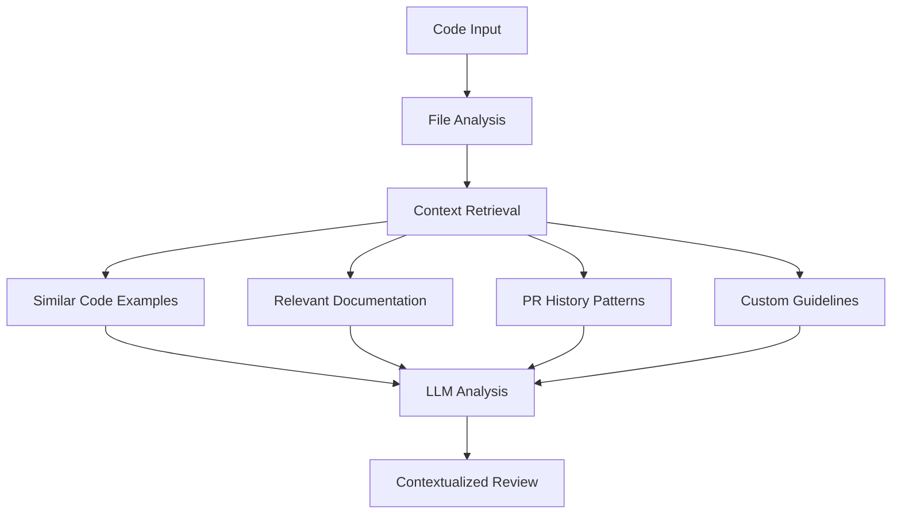

# AI Code Review Tool

A self-hosted, AI-powered code review tool using **RAG (Retrieval-Augmented Generation)** with local embeddings and Anthropic Claude for intelligent, context-aware code analysis. Supports any programming language with specialized features for JavaScript/TypeScript projects.

## Table of Contents

- [Overview](#overview)
- [Installation](#installation)
- [Quick Start](#quick-start)
- [Commands Reference](#commands-reference)
- [RAG Architecture](#rag-architecture)
- [Configuration](#configuration)
- [Output Formats](#output-formats)
- [Error Handling & Troubleshooting](#error-handling--troubleshooting)
- [Contributing](#contributing)
- [License](#license)

## Overview

### How RAG Powers Intelligent Code Review

The AI Code Review Tool uses **Retrieval-Augmented Generation (RAG)** to provide context-aware code analysis by combining:

- **Local embeddings** (via FastEmbed) for understanding your codebase patterns
- **Vector similarity search** to find relevant code examples and documentation
- **Historical PR analysis** to learn from past code review patterns
- **Custom document integration** for project-specific guidelines
- **LLM-powered analysis** (Anthropic Claude) with rich contextual information

This RAG-based approach provides more accurate, project-specific code reviews compared to generic static analysis tools.

### Key Features

- **🔍 Context-Aware Analysis**: Understands your codebase patterns and conventions
- **🌐 Universal Language Support**: Works with any programming language
- **⚡ Local Embeddings**: Uses FastEmbed for fast, privacy-respecting semantic search
- **📚 Custom Guidelines**: Integrate your team's coding standards and documentation
- **🔄 PR History Learning**: Learns from past code review patterns in your repository
- **📊 Multiple Output Formats**: Text, JSON, and Markdown output for flexible integration
- **🔧 Git Integration**: Analyze specific files, patterns, or branch differences
- **🚀 Easy Setup**: Works via npx in any project type

### Benefits

- **Reduced Review Time**: Automate repetitive aspects of code review
- **Consistent Standards**: Enforce coding standards uniformly across the codebase
- **Learning from History**: Leverage patterns from previous code reviews
- **Project-Specific**: Understands your codebase's unique patterns and conventions
- **Actionable Feedback**: Provides specific, constructive suggestions

## Installation

### Prerequisites

- **Node.js** v22.0.0 or higher
- **Git** (for diff-based analysis)
- **Anthropic API key** (for LLM analysis)

### API Key Setup

Set up your Anthropic API key using one of these methods:

#### Option 1: Environment Variable

```bash
export ANTHROPIC_API_KEY=your_anthropic_api_key
```

#### Option 2: .env File

Create a `.env` file in your project directory:

```env
ANTHROPIC_API_KEY=your_anthropic_api_key
```

#### Option 3: Inline with Command

```bash
ANTHROPIC_API_KEY=your_key npx ai-code-review analyze --file app.py
```

### Installation Options

> **Note**: This tool is currently in development and not yet published to npm. You'll need to run it locally for now.

#### Option 1: Run Locally (Current Method)

1. **Clone the repository**:

   ```bash
   git clone https://github.com/your-username/ai-code-review.git
   cd ai-code-review
   ```

2. **Install dependencies**:

   ```bash
   npm install
   ```

3. **Run the tool**:

   ```bash
   # Analyze a single file
   node src/index.js analyze --file path/to/file.py

   # Or use npm script (if available)
   npm start analyze --file path/to/file.py
   ```

   **Method B: Using Shell Script Wrapper (Recommended for non-JS projects)**

For easier integration with non-JavaScript projects, you can use the provided shell script wrapper:

1. **Copy the wrapper script** to your project:

   ```bash
   # From the ai-code-review repository
   cp src/ai-code-review.sh /path/to/your/project/ai-code-review.sh
   chmod +x /path/to/your/project/ai-code-review.sh
   ```

2. **Use the wrapper** (automatically handles environment setup):

   ```bash
   # The script will automatically:
   # - Check for Node.js installation
   # - Load .env file if present
   # - Verify ANTHROPIC_API_KEY
   # - Try global installation first, then fall back to npx

   ./ai-code-review.sh analyze --file path/to/file.py
   ./ai-code-review.sh embeddings:generate --directory src
   ```

3. **Environment setup** (the script handles this automatically):
   - Creates/uses `.env` file in your project directory
   - Validates Node.js v22.0.0+ requirement
   - Provides helpful error messages for missing dependencies

#### Option 2: Using npx (Future - Once Published)

```bash
# This will be available once the tool is published to npm
npx ai-code-review analyze --file path/to/file.py
```

#### Option 3: Global Installation (Future - Once Published)

```bash
# This will be available once the tool is published to npm
npm install -g ai-code-review
ai-code-review analyze --file path/to/file.py
```

## Quick Start

Follow this three-step workflow for optimal code review results:

### Step 1: Generate Embeddings (Required)

**Generate embeddings for your codebase first** - this is essential for context-aware analysis:

```bash
# Generate embeddings for current directory
npx ai-code-review embeddings:generate --directory src

# Generate for specific files or patterns
npx ai-code-review embeddings:generate --files "src/**/*.ts" "lib/*.js"

# Generate with exclusions (recommended for large codebases)
npx ai-code-review embeddings:generate --directory src --exclude "**/*.test.js" "**/*.spec.js"
```

### Step 2: Analyze PR History (Optional)

**Enhance reviews with historical context** by analyzing past PR comments. This step requires a GitHub token:

#### Prerequisites for PR History Analysis

You must set a `GITHUB_TOKEN` environment variable with repository access permissions:

```bash
# Set GitHub token (required for PR history analysis)
export GITHUB_TOKEN=your_github_token_here

# Or add to .env file
echo "GITHUB_TOKEN=your_github_token_here" >> .env
```

#### Run PR History Analysis

```bash
# Analyze PR history for current project (auto-detects GitHub repo)
npx ai-code-review pr-history:analyze

# Analyze specific repository
npx ai-code-review pr-history:analyze --repository owner/repo

# Analyze with date range
npx ai-code-review pr-history:analyze --since 2024-01-01 --until 2024-12-31
```

### Step 3: Analyze Code (Final Step)

**Now perform the actual code review** with rich context from embeddings and PR history:

#### Basic Analysis

```bash
# Analyze a single file
npx ai-code-review analyze --file src/components/Button.tsx

# Analyze files matching patterns
npx ai-code-review analyze --files "src/**/*.ts" "lib/*.js"

# Analyze changes in feature-branch vs main branch (auto-detects base branch)
npx ai-code-review analyze --diff-with feature-branch
```

#### Using with Custom Guidelines

```bash
# Include your team's coding standards
npx ai-code-review analyze \
  --file src/utils/validation.ts \
  --doc "Engineering Guidelines:./docs/guidelines.md" \
  --doc "API Standards:./docs/api-standards.md"
```

#### Non-JavaScript Projects

```bash
# Python project
cd /path/to/python/project
npx ai-code-review analyze --file app.py

# Ruby project
npx ai-code-review analyze --files "**/*.rb"

# Any language with git diff
npx ai-code-review analyze --diff-with feature-branch
```

## GitHub Actions Integration

The AI Code Review tool provides a reusable GitHub Actions composite action for seamless CI/CD integration. This action **automatically handles incremental embedding processing** by:

- **Initial Run**: Generates embeddings for the entire codebase when no previous embeddings exist
- **Subsequent Runs**: Downloads previous embeddings and processes only changed files for optimal performance
- **Automatic Detection**: The CLI tool automatically detects existing embeddings and switches to incremental mode

### Using the Embedding Generation Action

Add the embedding generation action to your GitHub workflow:

```yaml
name: Generate AI Code Review Embeddings
on:
  push:
    branches: [main]
    paths: ['src/**', 'lib/**']
  pull_request:
    branches: [main]

jobs:
  generate-embeddings:
    runs-on: ubuntu-latest
    steps:
      - uses: actions/checkout@v4

      - name: Generate Code Embeddings
        uses: cosmocoder/codecritique/.github/actions/generate-embeddings@main
        with:
          directory: 'src'
          concurrency: '10'
          verbose: 'true'
```

### Action Inputs

| Input                       | Description                                             | Required | Default               |
| --------------------------- | ------------------------------------------------------- | -------- | --------------------- |
| `directory`                 | Directory to process for embeddings                     | No       | `.`                   |
| `files`                     | Specific files or patterns to process (space-separated) | No       | `''`                  |
| `concurrency`               | Number of concurrent embedding requests                 | No       | `10`                  |
| `exclude`                   | Patterns to exclude (space-separated glob patterns)     | No       | See below\*           |
| `exclude-file`              | File containing patterns to exclude (one per line)      | No       | `''`                  |
| `no-gitignore`              | Disable automatic exclusion of files in .gitignore      | No       | `false`               |
| `verbose`                   | Show verbose output                                     | No       | `false`               |
| `cache-embeddings`          | Cache embeddings across runs                            | No       | `true`                |
| `embeddings-retention-days` | Number of days to retain embedding artifacts            | No       | `30`                  |
| `github-token`              | GitHub token for repository access                      | No       | `${{ github.token }}` |

_Default exclude patterns: `\*\*/_.test.js **/\*.spec.js **/_.test.ts \*\*/_.spec.ts **/node_modules/** **/dist/** **/build/** **/.git/**`

### Action Outputs

| Output                         | Description                                              |
| ------------------------------ | -------------------------------------------------------- |
| `embeddings-generated`         | Number of embeddings generated                           |
| `files-processed`              | Number of files processed                                |
| `database-size-mb`             | Size of embeddings database in MB                        |
| `processing-time`              | Processing time in seconds                               |
| `artifact-name`                | Name of the created embeddings artifact                  |
| `cache-hit`                    | Whether embeddings were restored from cache              |
| `previous-embeddings-restored` | Whether previous embeddings were restored from artifacts |
| `restored-artifact-name`       | Name of the restored embeddings artifact                 |

### How Incremental Processing Works

The action automatically manages incremental processing:

1. **First Run**: No previous embeddings exist, so the action generates embeddings for all files
2. **Subsequent Runs**: The action:
   - Downloads the most recent embedding artifacts from previous workflow runs
   - Restores them to the `.ai-review-lancedb` directory
   - The CLI tool detects existing embeddings and processes only changed files
   - Creates a new artifact with the updated embeddings

This approach provides significant performance benefits for large codebases while ensuring embeddings stay up-to-date.

### Usage Examples

#### Basic Usage (Works for Both Initial and Incremental Processing)

```yaml
- name: Generate Embeddings
  uses: cosmocoder/codecritique/.github/actions/generate-embeddings@main
```

The action automatically handles whether this is an initial run or an incremental update.

#### Custom Directory and Concurrency

```yaml
- name: Generate Embeddings for Source Code
  uses: cosmocoder/codecritique/.github/actions/generate-embeddings@main
  with:
    directory: 'src'
    concurrency: '15'
    verbose: 'true'
```

#### Specific Files and Exclusions

```yaml
- name: Generate Embeddings for TypeScript Files
  uses: cosmocoder/codecritique/.github/actions/generate-embeddings@main
  with:
    files: '**/*.ts **/*.tsx'
    exclude: '**/*.test.* **/*.spec.* **/dist/**'
    exclude-file: '.embedignore'
```

#### Complete Workflow with Outputs

```yaml
name: AI Code Review Setup
on:
  push:
    branches: [main]

jobs:
  generate-embeddings:
    runs-on: ubuntu-latest
    outputs:
      embeddings-count: ${{ steps.embeddings.outputs.embeddings-generated }}
      processing-time: ${{ steps.embeddings.outputs.processing-time }}
      cache-hit: ${{ steps.embeddings.outputs.cache-hit }}

    steps:
      - uses: actions/checkout@v4

      - name: Generate Code Embeddings
        id: embeddings
        uses: cosmocoder/codecritique/.github/actions/generate-embeddings@main
        with:
          directory: 'src'
          concurrency: '12'
          verbose: 'true'
          embeddings-retention-days: '60'

      - name: Report Results
        run: |
          echo "Generated ${{ steps.embeddings.outputs.embeddings-generated }} embeddings"
          echo "Processed ${{ steps.embeddings.outputs.files-processed }} files"
          echo "Database size: ${{ steps.embeddings.outputs.database-size-mb }} MB"
          echo "Processing time: ${{ steps.embeddings.outputs.processing-time }} seconds"
          echo "Cache hit: ${{ steps.embeddings.outputs.cache-hit }}"

  use-embeddings:
    needs: generate-embeddings
    runs-on: ubuntu-latest
    steps:
      - name: Download Embeddings
        uses: actions/download-artifact@v4
        with:
          name: ${{ needs.generate-embeddings.outputs.artifact-name }}
          path: .embeddings

      - name: Use Embeddings for Analysis
        run: |
          echo "Embeddings ready for AI analysis"
          # Your code analysis steps here
```

#### Conditional Processing

```yaml
- name: Generate Embeddings (if needed)
  uses: cosmocoder/codecritique/.github/actions/generate-embeddings@main
  if: github.event_name == 'push' || contains(github.event.pull_request.labels.*.name, 'ai-review')
  with:
    directory: 'src'
    cache-embeddings: 'true'
```

### Performance Optimization

For large repositories, optimize performance with these settings:

```yaml
- name: Generate Embeddings (Large Repo)
  uses: cosmocoder/codecritique/.github/actions/generate-embeddings@main
  with:
    directory: 'src'
    concurrency: '20' # Increase concurrency
    exclude: | # Exclude unnecessary files
      **/*.test.*
      **/*.spec.*
      **/node_modules/**
      **/dist/**
      **/build/**
      **/*.min.js
      **/coverage/**
    cache-embeddings: 'true' # Enable caching
    embeddings-retention-days: '90' # Longer retention for stable repos
```

### Caching Strategy

The action automatically implements intelligent caching:

- **Content-based**: Cache keys include repository content hash and configuration
- **Automatic invalidation**: Cache invalidates when code or settings change
- **Cross-run persistence**: Embeddings persist across workflow runs
- **Performance boost**: Subsequent runs are significantly faster with cache hits

### Integration Patterns

#### With Pull Request Reviews

The AI Code Review tool provides a complete PR review action that automatically posts intelligent comments to your pull requests:

```yaml
name: AI Code Review Pipeline
on:
  pull_request:
    types: [opened, synchronize]

jobs:
  generate-embeddings:
    runs-on: ubuntu-latest
    steps:
      - uses: actions/checkout@v4
      - name: Generate Embeddings
        id: embeddings
        uses: cosmocoder/codecritique/.github/actions/generate-embeddings@main
        with:
          directory: 'src'
          concurrency: '10'

  ai-review:
    needs: generate-embeddings
    runs-on: ubuntu-latest
    steps:
      - uses: actions/checkout@v4
      - name: AI Code Review
        uses: cosmocoder/codecritique/.github/actions/pr-review@main
        with:
          anthropic-api-key: ${{ secrets.ANTHROPIC_API_KEY }}
          embedding-artifact-name: ${{ needs.generate-embeddings.outputs.artifact-name }}
```

#### PR Review Action

For detailed documentation on the PR review action, see the key inputs:

| Input               | Description                                         | Default                      |
| ------------------- | --------------------------------------------------- | ---------------------------- |
| `anthropic-api-key` | Anthropic API key for Claude models                 | Required                     |
| `base-branch`       | Base branch to compare against                      | `main`                       |
| `model`             | LLM model to use                                    | `claude-3-5-sonnet-20241022` |
| `max-comments`      | Maximum review comments to post                     | `25`                         |
| `custom-docs`       | Custom guidelines (format: "title:path,title:path") | `''`                         |
| `verbose`           | Show detailed output                                | `false`                      |

#### Artifact Cleanup Action

The AI Code Review tool includes a comprehensive artifact cleanup action for managing storage and maintaining clean repositories:

```yaml
name: Daily Artifact Cleanup
on:
  schedule:
    - cron: '0 2 * * *' # Run daily at 2 AM UTC
  workflow_dispatch:

jobs:
  cleanup:
    runs-on: ubuntu-latest
    steps:
      - name: Cleanup Old Artifacts
        uses: cosmocoder/codecritique/.github/actions/cleanup-artifacts@main
        with:
          cleanup-type: 'all'
          older-than-days: '30'
          dry-run: 'false'
          verbose: 'true'
```

**Key Features:**

- **Selective Cleanup**: Target specific artifact types (embeddings, models, feedback, reports)
- **Safety Features**: Dry-run mode, confirmation prompts, backup creation
- **Age-based Filtering**: Only cleanup artifacts older than specified days
- **Pattern Matching**: Custom artifact name patterns and exclusion rules
- **Comprehensive Reporting**: Detailed cleanup reports with metrics
- **Error Handling**: Graceful error handling with detailed error reporting

#### Cleanup Action Inputs

| Input                   | Description                                                 | Required | Default                    |
| ----------------------- | ----------------------------------------------------------- | -------- | -------------------------- |
| `github-token`          | GitHub token for repository access                          | No       | `${{ github.token }}`      |
| `cleanup-type`          | Type of cleanup: all, embeddings, models, feedback, reports | No       | `all`                      |
| `older-than-days`       | Only cleanup artifacts older than specified days (0 = all)  | No       | `30`                       |
| `repository`            | Repository to cleanup (format: owner/repo)                  | No       | `${{ github.repository }}` |
| `dry-run`               | Preview cleanup actions without deleting                    | No       | `false`                    |
| `require-confirmation`  | Require explicit confirmation before deletion               | No       | `false`                    |
| `create-backup`         | Create backup artifacts before deletion                     | No       | `false`                    |
| `backup-retention-days` | Retention days for backup artifacts                         | No       | `7`                        |
| `artifact-name-pattern` | Custom artifact name pattern (supports wildcards)           | No       | `''`                       |
| `exclude-patterns`      | Comma-separated patterns to exclude from cleanup            | No       | `''`                       |
| `max-artifacts-per-run` | Maximum artifacts to process in one run                     | No       | `50`                       |
| `verbose`               | Show detailed cleanup progress                              | No       | `false`                    |
| `generate-report`       | Generate detailed cleanup report as artifact                | No       | `true`                     |

#### Cleanup Action Outputs

| Output                     | Description                                    |
| -------------------------- | ---------------------------------------------- |
| `artifacts-deleted`        | Number of artifacts successfully deleted       |
| `space-reclaimed-mb`       | Estimated storage space reclaimed in MB        |
| `cleanup-summary`          | Summary of cleanup actions performed           |
| `errors-count`             | Number of errors encountered during cleanup    |
| `failed-deletions`         | List of artifacts that failed to delete        |
| `backup-artifacts-created` | Number of backup artifacts created             |
| `processing-time`          | Total time taken for cleanup process (seconds) |
| `artifacts-processed`      | Total number of artifacts processed            |

#### Cleanup Types

- **`all`**: Cleans up all AI Code Review related artifacts (embeddings, models, feedback, reports)
- **`embeddings`**: Only embedding artifacts (`ai-code-review-embeddings-*`)
- **`models`**: Model cache artifacts (`ai-model-cache-*`, `ai-fastembed-cache-*`)
- **`feedback`**: Feedback tracking artifacts (`review-feedback`, `ai-feedback-*`)
- **`reports`**: Review report artifacts (`ai-review-report-*`)

#### Safety Features

**Dry Run Mode** - Preview what would be deleted:

```yaml
- name: Preview Cleanup
  uses: cosmocoder/codecritique/.github/actions/cleanup-artifacts@main
  with:
    cleanup-type: 'embeddings'
    older-than-days: '30'
    dry-run: 'true'
    verbose: 'true'
```

**Backup Creation** - Create backup artifacts before deletion:

```yaml
- name: Safe Cleanup with Backup
  uses: cosmocoder/codecritique/.github/actions/cleanup-artifacts@main
  with:
    cleanup-type: 'all'
    older-than-days: '60'
    create-backup: 'true'
    backup-retention-days: '14'
```

**Pattern Matching** - Target specific patterns and exclude critical artifacts:

```yaml
- name: Selective Cleanup
  uses: cosmocoder/codecritique/.github/actions/cleanup-artifacts@main
  with:
    cleanup-type: 'all'
    artifact-name-pattern: 'ai-code-review-embeddings-*'
    exclude-patterns: 'production-*,critical-*,master-branch-*'
    older-than-days: '30'
```

#### Example Workflows

**PR-triggered Cleanup:**

```yaml
name: Cleanup on PR Close
on:
  pull_request:
    types: [closed]

jobs:
  cleanup-pr-artifacts:
    runs-on: ubuntu-latest
    steps:
      - name: Cleanup PR-specific Artifacts
        uses: cosmocoder/codecritique/.github/actions/cleanup-artifacts@main
        with:
          cleanup-type: 'reports'
          artifact-name-pattern: 'ai-review-report-${{ github.event.pull_request.number }}'
          older-than-days: '0' # Clean regardless of age
          verbose: 'true'
```

**Safe Production Cleanup:**

```yaml
name: Production Artifact Cleanup
on:
  workflow_dispatch:
    inputs:
      confirm_cleanup:
        description: 'Type "CONFIRM" to proceed with cleanup'
        required: true
        type: string

jobs:
  cleanup:
    runs-on: ubuntu-latest
    if: github.event.inputs.confirm_cleanup == 'CONFIRM'
    steps:
      - name: Production Cleanup with Backup
        uses: cosmocoder/codecritique/.github/actions/cleanup-artifacts@main
        with:
          cleanup-type: 'all'
          older-than-days: '30'
          create-backup: 'true'
          backup-retention-days: '30'
          exclude-patterns: 'production-*,master-*,release-*'
          max-artifacts-per-run: '50'
          verbose: 'true'
          generate-report: 'true'
```

#### Best Practices

1. **Always Test First**: Use `dry-run: 'true'` to preview actions
2. **Use Age Filters**: Set appropriate `older-than-days` values
3. **Create Backups**: Enable `create-backup: 'true'` for critical artifacts
4. **Monitor Reports**: Review generated cleanup reports
5. **Set Limits**: Use `max-artifacts-per-run` to prevent overwhelming the API
6. **Use Exclusions**: Protect critical artifacts with `exclude-patterns`
7. **Enable Verbose**: Use `verbose: 'true'` for detailed logging during testing

```yaml
# Advanced PR Review Configuration
- name: AI Code Review with Custom Settings
  uses: cosmocoder/codecritique/.github/actions/pr-review@main
  with:
    anthropic-api-key: ${{ secrets.ANTHROPIC_API_KEY }}
    base-branch: 'develop'
    max-comments: 15
    custom-docs: 'Guidelines:./docs/guidelines.md,Standards:./docs/standards.md'
    verbose: true
```

#### Scheduled Embedding Updates

```yaml
name: Weekly Embedding Refresh
on:
  schedule:
    - cron: '0 2 * * 0' # Weekly on Sunday

jobs:
  refresh-embeddings:
    runs-on: ubuntu-latest
    steps:
      - uses: actions/checkout@v4
      - uses: cosmocoder/codecritique/.github/actions/generate-embeddings@main
        with:
          cache-embeddings: 'false' # Force refresh
          embeddings-retention-days: '180'
```

## Commands Reference

### analyze

Analyze code using RAG (Retrieval-Augmented Generation) approach with dynamic context retrieval.

```bash
ai-code-review analyze [options]
```

#### Options

| Option                     | Description                                                                             | Default |
| -------------------------- | --------------------------------------------------------------------------------------- | ------- |
| `-b, --diff-with <branch>` | Analyze files changed in the specified branch compared to the base branch (main/master) | -       |
| `-f, --files <files...>`   | Specific files or glob patterns to review                                               | -       |
| `--file <file>`            | Analyze a single file                                                                   | -       |
| `-d, --directory <dir>`    | Working directory for git operations (use with --diff-with)                             | -       |
| `-o, --output <format>`    | Output format (text, json, markdown)                                                    | `text`  |
| `--no-color`               | Disable colored output                                                                  | `false` |
| `--verbose`                | Show verbose output                                                                     | `false` |

| `--model <model>` | LLM model to use (e.g., claude-sonnet-4-20250514) | `claude-sonnet-4-20250514` |
| `--temperature <number>` | LLM temperature | `0.2` |
| `--max-tokens <number>` | LLM max tokens | `8192` |
| `--similarity-threshold <number>` | Threshold for finding similar code examples | `0.6` |
| `--max-examples <number>` | Max similar code examples to use | `5` |
| `--concurrency <number>` | Concurrency for processing multiple files | `3` |
| `--doc <specs...>` | Custom documents to provide to LLM (format: "Title:./path/to/file.md") | - |

#### Examples

```bash
# Analyze a single file
ai-code-review analyze --file src/components/Button.tsx

# Analyze multiple files with patterns
ai-code-review analyze --files "src/**/*.tsx" "lib/*.js"

# Analyze changes in feature-branch vs main branch (auto-detects base branch)
ai-code-review analyze --diff-with feature-branch

# Analyze with custom documentation
ai-code-review analyze --file src/utils/validation.ts \
  --doc "Engineering Guidelines:./docs/guidelines.md"

# Analyze with custom LLM settings
ai-code-review analyze --file app.py \
  --temperature 0.1 \
  --max-tokens 4096 \
  --similarity-threshold 0.7

# Analyze changes in specific directory
ai-code-review analyze --diff-with feature-branch --directory /path/to/repo

# Output as JSON
ai-code-review analyze --files "src/**/*.ts" --output json > review.json
```

### embeddings:generate

Generate embeddings for the codebase to enable context-aware analysis.

```bash
ai-code-review embeddings:generate [options]
```

#### Options

| Option                       | Description                                                                    | Default |
| ---------------------------- | ------------------------------------------------------------------------------ | ------- |
| `-d, --directory <dir>`      | Directory to process                                                           | `.`     |
| `-f, --files <files...>`     | Specific files or patterns to process                                          | -       |
| `-c, --concurrency <number>` | Number of concurrent embedding requests                                        | `10`    |
| `--verbose`                  | Show verbose output                                                            | `false` |
| `--exclude <patterns...>`    | Patterns to exclude (e.g., "**/\*.test.js" "docs/**")                          | -       |
| `--exclude-file <file>`      | File containing patterns to exclude (one per line)                             | -       |
| `--no-gitignore`             | Disable automatic exclusion of files in .gitignore                             | `false` |
| `--max-lines`                | Maximum lines per code file that will be considered when generating embeddings | `1000`  |

#### Examples

```bash
# Generate embeddings for current directory
ai-code-review embeddings:generate

# Generate for specific directory
ai-code-review embeddings:generate --directory src

# Generate for specific files
ai-code-review embeddings:generate --files "src/**/*.tsx" "lib/*.js"

# Exclude test files and docs
ai-code-review embeddings:generate --exclude "**/*.test.js" "**/*.spec.js" "docs/**"

# Use exclusion file
ai-code-review embeddings:generate --exclude-file exclusion-patterns.txt

# Process without gitignore exclusions
ai-code-review embeddings:generate --no-gitignore

# High concurrency for large codebases
ai-code-review embeddings:generate --concurrency 20 --verbose
```

### embeddings:stats

Show statistics about stored embeddings.

```bash
ai-code-review embeddings:stats [options]
```

#### Options

| Option                  | Description                                                                      | Default |
| ----------------------- | -------------------------------------------------------------------------------- | ------- |
| `-d, --directory <dir>` | Directory of the project to show stats for (shows all projects if not specified) | -       |

#### Examples

```bash
# Show stats for all projects
ai-code-review embeddings:stats

# Show stats for specific project
ai-code-review embeddings:stats --directory /path/to/project
```

### embeddings:clear

Clear stored embeddings for the current project.

```bash
ai-code-review embeddings:clear [options]
```

#### Options

| Option                  | Description                                      | Default |
| ----------------------- | ------------------------------------------------ | ------- |
| `-d, --directory <dir>` | Directory of the project to clear embeddings for | `.`     |

#### Examples

```bash
# Clear embeddings for current project
ai-code-review embeddings:clear

# Clear embeddings for specific project
ai-code-review embeddings:clear --directory /path/to/project
```

### embeddings:clear-all

Clear ALL stored embeddings (affects all projects - use with caution).

```bash
ai-code-review embeddings:clear-all
```

**Warning**: This command clears embeddings for all projects on the machine.

### pr-history:analyze

Analyze PR comment history for the current project or specified repository.

```bash
ai-code-review pr-history:analyze [options]
```

#### Options

| Option                    | Description                                                         | Default |
| ------------------------- | ------------------------------------------------------------------- | ------- |
| `-d, --directory <dir>`   | Project directory to analyze (auto-detects GitHub repo)             | `.`     |
| `-r, --repository <repo>` | GitHub repository in format "owner/repo" (overrides auto-detection) | -       |
| `-t, --token <token>`     | GitHub API token (or set GITHUB_TOKEN env var)                      | -       |
| `--since <date>`          | Only analyze PRs since this date (ISO format)                       | -       |
| `--until <date>`          | Only analyze PRs until this date (ISO format)                       | -       |
| `--limit <number>`        | Limit number of PRs to analyze                                      | -       |
| `--resume`                | Resume interrupted analysis                                         | `false` |
| `--clear`                 | Clear existing data before analysis                                 | `false` |
| `--concurrency <number>`  | Number of concurrent requests                                       | `2`     |
| `--batch-size <number>`   | Batch size for processing                                           | `50`    |
| `--verbose`               | Show verbose output                                                 | `false` |

#### Examples

```bash
# Analyze current project (auto-detect repo)
ai-code-review pr-history:analyze

# Analyze specific repository
ai-code-review pr-history:analyze --repository owner/repo --token ghp_xxx

# Analyze with date range
ai-code-review pr-history:analyze --since 2024-01-01 --until 2024-12-31

# Clear existing data and re-analyze
ai-code-review pr-history:analyze --clear --limit 100

# Resume interrupted analysis
ai-code-review pr-history:analyze --resume
```

### pr-history:status

Check PR analysis status for the current project or specified repository.

```bash
ai-code-review pr-history:status [options]
```

#### Options

| Option                    | Description                                                         | Default |
| ------------------------- | ------------------------------------------------------------------- | ------- |
| `-d, --directory <dir>`   | Project directory to check status for                               | `.`     |
| `-r, --repository <repo>` | GitHub repository in format "owner/repo" (overrides auto-detection) | -       |

#### Examples

```bash
# Check status for current project
ai-code-review pr-history:status

# Check status for specific repository
ai-code-review pr-history:status --repository owner/repo
```

### pr-history:clear

Clear PR analysis data for the current project or specified repository.

```bash
ai-code-review pr-history:clear [options]
```

#### Options

| Option                    | Description                                                         | Default |
| ------------------------- | ------------------------------------------------------------------- | ------- |
| `-d, --directory <dir>`   | Project directory to clear data for                                 | `.`     |
| `-r, --repository <repo>` | GitHub repository in format "owner/repo" (overrides auto-detection) | -       |
| `--force`                 | Skip confirmation prompts                                           | `false` |

#### Examples

```bash
# Clear data for current project (with confirmation)
ai-code-review pr-history:clear

# Clear data for specific repository without confirmation
ai-code-review pr-history:clear --repository owner/repo --force
```

## RAG Architecture

### How RAG Works

The Retrieval-Augmented Generation (RAG) approach enhances traditional AI code review by providing rich context:



### Components

1. **Embedding Engine**: Uses FastEmbed to generate vector representations of code and documentation
2. **Vector Database**: LanceDB stores embeddings for fast similarity search
3. **Context Retrieval**: Finds relevant code examples, documentation, and historical patterns
4. **LLM Integration**: Anthropic Claude analyzes code with rich contextual information
5. **PR History Analyzer**: Learns from past code review patterns in your repository

### Benefits of RAG

- **Project-Specific**: Understands your codebase's unique patterns
- **Learning**: Improves recommendations based on historical data
- **Comprehensive**: Considers code, docs, and review history together
- **Efficient**: Local embeddings provide fast context retrieval
- **Privacy**: Embeddings are stored locally, code never leaves your machine

## Configuration

### Custom Documents

Integrate your team's guidelines and documentation:

```bash
ai-code-review analyze --file src/component.tsx \
  --doc "Engineering Guidelines:./docs/engineering.md" \
  --doc "React Standards:./docs/react-guide.md" \
  --doc "API Guidelines:./docs/api-standards.md"
```

Document format: `"Title:./path/to/file.md"`

### Embedding Exclusions

#### Using exclusion files

Create a file containing exclusion patterns (one per line) and reference it with `--exclude-file`:

```
# Example: exclusion-patterns.txt
# Exclude test files
**/*.test.js
**/*.spec.js
**/*.test.ts
**/*.spec.ts

# Exclude build outputs
dist/
build/
*.min.js

# Exclude dependencies
node_modules/
vendor/
```

#### Using command-line exclusions

```bash
ai-code-review embeddings:generate \
  --exclude "**/*.test.js" "dist/**" "node_modules/**"
```

### Environment Variables

```env
# Required
ANTHROPIC_API_KEY=your_anthropic_api_key

# Optional for PR history analysis
GITHUB_TOKEN=your_github_token

# Optional debugging
DEBUG=true
VERBOSE=true
```

## Output Formats

### Text (Default)

Human-readable colored output for terminal usage:

```
===== AI Code Review Summary =====
Files Analyzed: 3
Files with Issues: 2
Total Issues Found: 5

===== Review for src/components/Button.tsx =====
Summary: Component has naming inconsistency and missing prop validation

Issues:
  [MAJOR] (Lines: 5) Component name 'ButtonComponent' doesn't match filename 'Button'
    Suggestion: Rename component to 'Button' or update file name

  [MINOR] (Lines: 12-15) Missing prop type validation
    Suggestion: Add PropTypes or TypeScript interface

Positives:
  - Good use of semantic HTML elements
  - Proper accessibility attributes
```

### JSON

Structured output for programmatic processing:

```json
{
  "summary": {
    "totalFilesReviewed": 3,
    "filesWithIssues": 2,
    "totalIssues": 5,
    "skippedFiles": 0,
    "errorFiles": 0
  },
  "details": [
    {
      "filePath": "src/components/Button.tsx",
      "success": true,
      "language": "typescript",
      "review": {
        "summary": "Component has naming inconsistency and missing prop validation",
        "issues": [
          {
            "severity": "major",
            "description": "Component name 'ButtonComponent' doesn't match filename 'Button'",
            "lineNumbers": [5],
            "suggestion": "Rename component to 'Button' or update file name"
          }
        ],
        "positives": ["Good use of semantic HTML elements", "Proper accessibility attributes"]
      }
    }
  ]
}
```

### Markdown

Documentation-friendly format:

```markdown
# AI Code Review Results (RAG Approach)

## Summary

- **Files Analyzed:** 3
- **Files with Issues:** 2
- **Total Issues Found:** 5

## Detailed Review per File

### src/components/Button.tsx

**Summary:** Component has naming inconsistency and missing prop validation

**Issues Found (2):**

- **[MAJOR] 🔥 (Lines: 5)**: Component name 'ButtonComponent' doesn't match filename 'Button'
- **[MINOR] 💡 (Lines: 12-15)**: Missing prop type validation

**Positives Found (2):**

- Good use of semantic HTML elements
- Proper accessibility attributes
```

## Error Handling & Troubleshooting

### Common Issues

#### API Key Issues

**Error**: `ANTHROPIC_API_KEY not found in environment variables`

**Solution**:

```bash
# Set environment variable
export ANTHROPIC_API_KEY=your_api_key

# Or create .env file
echo "ANTHROPIC_API_KEY=your_api_key" > .env
```

#### Git Repository Issues

**Error**: `Not a git repository`

**Solution**: Ensure you're in a git repository when using `--diff-with`:

```bash
git init  # If needed
git add .
git commit -m "Initial commit"
```

#### File Not Found

**Error**: `File not found: path/to/file.js`

**Solution**: Check file path and ensure it exists:

```bash
# Use absolute path
ai-code-review analyze --file /full/path/to/file.js

# Or relative from current directory
ls path/to/file.js  # Verify file exists
```

#### Embedding Generation Issues

**Error**: `Failed to generate embeddings`

**Solutions**:

```bash
# Clear existing embeddings and regenerate
ai-code-review embeddings:clear
ai-code-review embeddings:generate --verbose

# Reduce concurrency for memory issues
ai-code-review embeddings:generate --concurrency 5

# Exclude problematic files
ai-code-review embeddings:generate --exclude "large-files/**"
```

#### Memory Issues

**Error**: `JavaScript heap out of memory`

**Solutions**:

```bash
# Increase Node.js memory limit
export NODE_OPTIONS="--max-old-space-size=4096"

# Process fewer files at once
ai-code-review embeddings:generate --concurrency 3

# Exclude large files
ai-code-review embeddings:generate --exclude "**/*.min.js" "dist/**"
```

### Debugging

Enable verbose output for detailed logging:

```bash
ai-code-review analyze --file app.py --verbose
```

Enable debug mode:

```bash
DEBUG=true ai-code-review analyze --file app.py
```

### Performance Optimization

1. **Generate embeddings first** for better context:

   ```bash
   ai-code-review embeddings:generate
   ai-code-review analyze --files "src/**/*.ts"
   ```

2. **Use exclusion patterns** to skip irrelevant files:

   ```bash
   ai-code-review embeddings:generate --exclude "**/*.test.js" "dist/**"
   ```

3. **Adjust concurrency** based on system resources:

   ```bash
   # For powerful machines
   ai-code-review embeddings:generate --concurrency 20

   # For resource-constrained environments
   ai-code-review embeddings:generate --concurrency 3
   ```

## Dependencies

### Core Dependencies

- **[@anthropic-ai/sdk](https://www.npmjs.com/package/@anthropic-ai/sdk)** `0.55.0` - Anthropic Claude API integration
- **[@lancedb/lancedb](https://www.npmjs.com/package/@lancedb/lancedb)** `0.19.0` - Vector database for embeddings
- **[fastembed](https://www.npmjs.com/package/fastembed)** `^1.14.4` - Local embedding generation
- **[commander](https://www.npmjs.com/package/commander)** `^11.0.0` - CLI framework
- **[chalk](https://www.npmjs.com/package/chalk)** `^5.3.0` - Terminal colors
- **[glob](https://www.npmjs.com/package/glob)** `^10.3.0` - File pattern matching

### Optional Dependencies

- **[@octokit/rest](https://www.npmjs.com/package/@octokit/rest)** `21.1.1` - GitHub API (for PR history analysis)
- **[dotenv](https://www.npmjs.com/package/dotenv)** `16.5.0` - Environment variable loading

### Development Dependencies

- **[eslint](https://www.npmjs.com/package/eslint)** `9.29.0` - Code linting
- **[prettier](https://www.npmjs.com/package/prettier)** `3.5.3` - Code formatting
- **[typescript](https://www.npmjs.com/package/typescript)** `5.8.3` - TypeScript support

## Contributing

We welcome contributions! Please follow these guidelines:

### Development Setup

1. **Clone the repository**:

   ```bash
   git clone https://github.com/your-username/ai-code-review.git
   cd ai-code-review
   ```

2. **Install dependencies**:

   ```bash
   npm install
   ```

3. **Set up environment**:

   ```bash
   cp .env.example .env
   # Add your API keys to .env
   ```

4. **Run locally**:
   ```bash
   node src/index.js analyze --file test-file.js
   ```

### Code Standards

- **ESLint**: Follow the configured ESLint rules
- **Prettier**: Code is automatically formatted
- **TypeScript**: Type definitions for better code quality

### Testing

```bash
# Run linting
npm run lint

# Run formatting
npm run prettier

# Check for unused dependencies
npm run knip
```

### Submitting Changes

1. **Fork the repository**
2. **Create a feature branch**: `git checkout -b feature/amazing-feature`
3. **Make your changes**
4. **Run tests**: `npm run lint && npm run prettier:ci`
5. **Commit your changes**: `git commit -m 'Add amazing feature'`
6. **Push to the branch**: `git push origin feature/amazing-feature`
7. **Open a Pull Request**

### Areas for Contribution

- **Language Support**: Add specialized rules for new programming languages
- **LLM Providers**: Integrate additional LLM providers (OpenAI, etc.)
- **Output Formats**: Add new output formats (XML, SARIF, etc.)
- **Performance**: Optimize embedding generation and search
- **Documentation**: Improve documentation and examples
- **Testing**: Add comprehensive test coverage

### Reporting Issues

Please use GitHub Issues to report bugs or request features. Include:

- **System information** (OS, Node.js version)
- **Command used** and **full error message**
- **Expected vs actual behavior**
- **Minimal reproduction case**

## License

MIT License - see [LICENSE](LICENSE) file for details.
