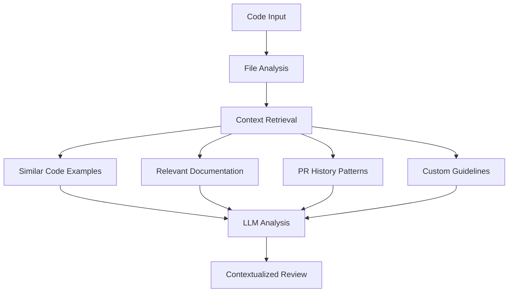

# CodeCritique Architecture

This document describes the internal architecture of the CodeCritique project, focusing on how the Retrieval-Augmented Generation (RAG) system works to provide intelligent, context-aware code reviews.

## How RAG Works

The Retrieval-Augmented Generation (RAG) approach enhances traditional AI code review by providing rich context from your codebase, documentation, and historical patterns. The system retrieves relevant information before generating review recommendations, ensuring that suggestions are tailored to your project's specific context and conventions.

## Components

### Embedding Engine

Uses [FastEmbed](https://github.com/qdrant/fastembed) to generate vector representations of code and documentation. The embedding engine converts code snippets, documentation text, and historical review patterns into high-dimensional vectors that capture semantic meaning. This allows the system to find similar code patterns and relevant documentation even when exact text matches don't exist.

Additionally, [Hugging Face Transformers.js](https://github.com/huggingface/transformers.js) is used for specialized NLP tasks like zero-shot classification and tokenization.

### Vector Database

[LanceDB](https://lancedb.com/) stores embeddings for fast similarity search. The vector database maintains an index of all embedded code examples, documentation, and review patterns, enabling efficient retrieval of relevant context. LanceDB's columnar storage format provides excellent performance for similarity searches across large codebases. It supports hybrid search combining vector similarity and full-text search with Reciprocal Rank Fusion (RRF) for optimal results.

### Context Retrieval

Finds relevant code examples, documentation, and historical patterns. When reviewing code, the system queries the vector database to retrieve:

- Similar code examples from your codebase that demonstrate established patterns
- Relevant documentation that explains conventions or best practices
- Historical review patterns from past pull requests that show how similar issues were addressed
- Custom guidelines and rules specific to your project

### LLM Integration

[Anthropic Claude](https://www.anthropic.com/) (claude-sonnet-4-5 by default) analyzes code with rich contextual information. The retrieved context is combined with the code being reviewed and sent to Claude, which performs a comprehensive analysis considering:

- The code structure and logic
- Similar patterns from your codebase
- Relevant documentation and guidelines
- Historical review feedback patterns

### PR History Analyzer

Learns from past code review patterns in your repository. This component analyzes previous pull requests to understand:

- Common review patterns and feedback types
- Project-specific conventions and preferences
- Recurring issues and how they were addressed
- Evolution of coding standards over time

### Feedback System

Tracks user reactions to review comments to continuously improve recommendations. When users dismiss suggestions (through reactions or keywords like "disagree" or "ignore"), the system learns to avoid similar issues in future reviews of the same pull-request, creating a more streamlined experience.

## Benefits of RAG

### Project-Specific

Understands your codebase's unique patterns. Unlike generic code review tools, CodeCritique learns from your actual codebase, recognizing project-specific conventions, architectural patterns, and coding styles. This ensures recommendations align with your team's established practices.

### Learning

Improves recommendations based on historical data. As the system processes more code reviews and pull requests, it builds a richer understanding of your project's patterns and preferences. The PR History Analyzer continuously learns from past reviews, making future recommendations more accurate and relevant.

### Comprehensive

Considers code, docs, and review history together. The RAG system doesn't just look at the code in isolation—it synthesizes information from multiple sources:

- Similar code examples show how similar problems were solved
- Documentation provides context about intended patterns and conventions
- Review history reveals what reviewers typically look for and how they provide feedback

### Efficient

Local embeddings provide fast context retrieval. All embeddings are generated and stored locally, enabling rapid similarity searches without network latency. The vector database can quickly retrieve relevant context even from large codebases, making the review process fast and responsive.

### Privacy

Embeddings are stored locally, code never leaves your machine. Your source code remains on your local machine throughout the entire process. Only embeddings (mathematical representations) are stored, and when using the LLM, only the code being reviewed along with retrieved context is sent—never your entire codebase.

---

For more information about CodeCritique, see the [main README](../README.md).
